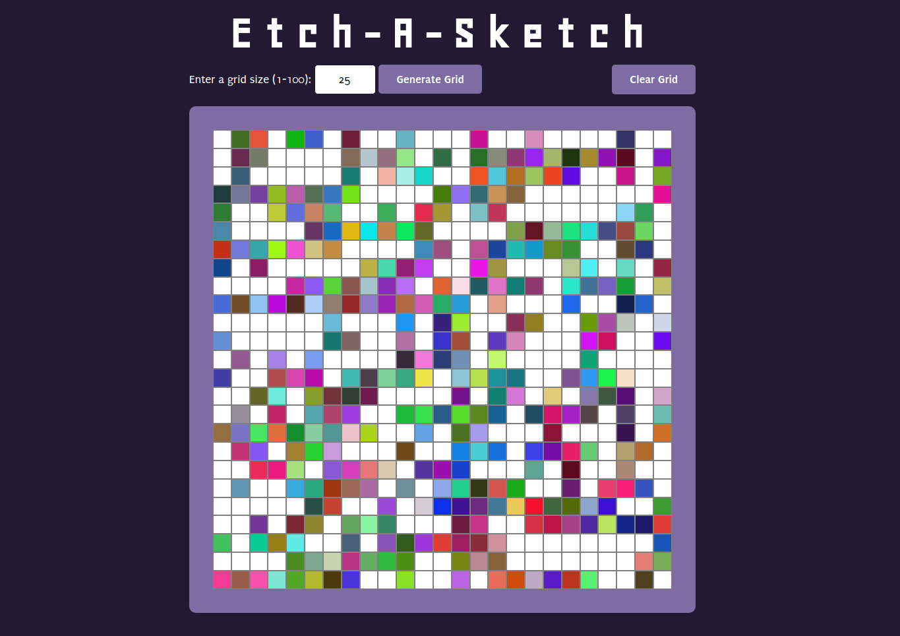

# Etch-A-Sketch

## Overview
This Etch-A-Sketch project was created as part of The Odin Project's curriculum to test what was learned of JavaScript and DOM manipulation so far.

## Screenshot

## Features
The objectives of the original assignment were to generate a grid of boxes that turn black upon mouse-hover. The grid size should also be re-sizable based on user input via prompt. The extra credit objectives take things a step further and require a random RGB color to be generated and applied when each box is hovered over and then turn that color 10% darker with each subsequent hover until it turns completely black after 10 passes.

For my version of the project, I implemented a simple input form with basic form validation to allow the user to input a desired grid size between 1-100. If the user enters an invalid value, the input box will turn red and the button is disabled until the user fixes the value to a valid value.

I also implemented a Clear Grid feature, which allows the user to clear the grid from any color and start from a blank grid again.

In addition, I implemented the extra credit objectives of generating a random color upon hover and then darkening those colors with each subsequent hover.

## What I Learned
While I found the base assignment fairly straight-forward, I found it a challenge to implement the incremental color darkening feature. Since the color had to be reduced by 10% and be completely black after 10 passes over the square, it would seem, to my understanding, that the original color of the square had to be kept track of to calculate the 10% reduction correctly.

At first, I was considering adding a custom property to each div element to keep track of the original color to calculate the 10% decrement from, since it wasn't practical to have a bunch of variables for each square. However, I found that adding custom properties to DOM elements is generally frowned upon and can cause issues with HTML validation.

I then researched more about data-* attributes and decided that this solution could work to store the original color on the div. After storing the original RGB value this way, I broke down the RGB string with regex to pull out each of the RGB values and did the same with the current color of the square.

With the values of the original color to calculate the 10% decrement value with and the values of the current color of the square, I was able to achieve the square turning to black after 10 passes.

This solution works, though I'm sure there is a more eloquent solution. I would like to revisit this in the future after learning more to see if I can't clean it up some or approach the problem differently.

## What I Used
* Git
* GitHub
* HTML / CSS
* JavaScript
* VSCode

## Live Demo
[View Live Demo](https://creative-cookie.github.io/odin-etch-a-sketch)